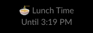

# Purpose
I have too many slack workspaces that all need to be in sync for my status, so, here is a status updater.
Slack is a bit of a pain, in that you need to create an app for each workspace account, but, once you get over that hill, life is good!


# Usage
Once setup, you can just call your script with python and an argument, and poof, your status is up-to-date!

`python status.py lunch` and bam! 

## Creating Your Slack App(s)
1. Head to [https://api.slack.com/apps](https://api.slack.com/apps)
2. Click "Create a New App"
3. Select "From Scratch"
4. On the left menu, find "OAuth & Permissions" and hit that
5. Scroll down to scopes and Add an OAuth Scope under the "User Token Scopes", here yuo need `users.profile:write`
6. At the top of this page you can install your app to the workspace
7. Copy the User OAuth Token (starting in `xoxp-`) into your `.env` file (see `.env.sample`)
   
## Setup your virtual environment
For me this looks like:
```bash
pyenv virtualenv 3.12 slack
pyenv activate slack
pip install -r requirements.txt
```
To make sure you've set things up without updating your status, you can clear your active status with:
```
python status.py clear
```

## Aliases

```bash
alias brb="<PATH TO PYTHON>/python <PATH TO REPO>/status.py brb"
alias slack_clear="<PATH TO PYTHON>/python <PATH TO REPO>/status.py clear"
alias lunch="<PATH TO PYTHON>/python <PATH TO REPO>/status.py lunch"
```

## Out of the box commands

1. `python status.py clear` will clear your status
2. `python status.py brb` will set you to BRB for 15 minutes
3. `python status.py lunch` will set your status to "Lunch Time" for 60 minutes and use a random food-based emoji
4. Lastly you can provide a custom status, emoji and duration for your own status-based flair! For example: `python status.py custom --message "Taking the kids to Soccer" --emoji ":soccer:" --time 120` 
